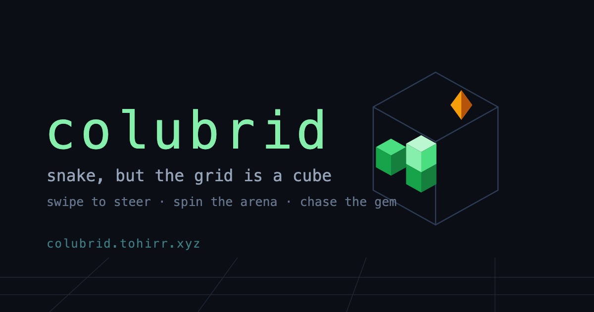
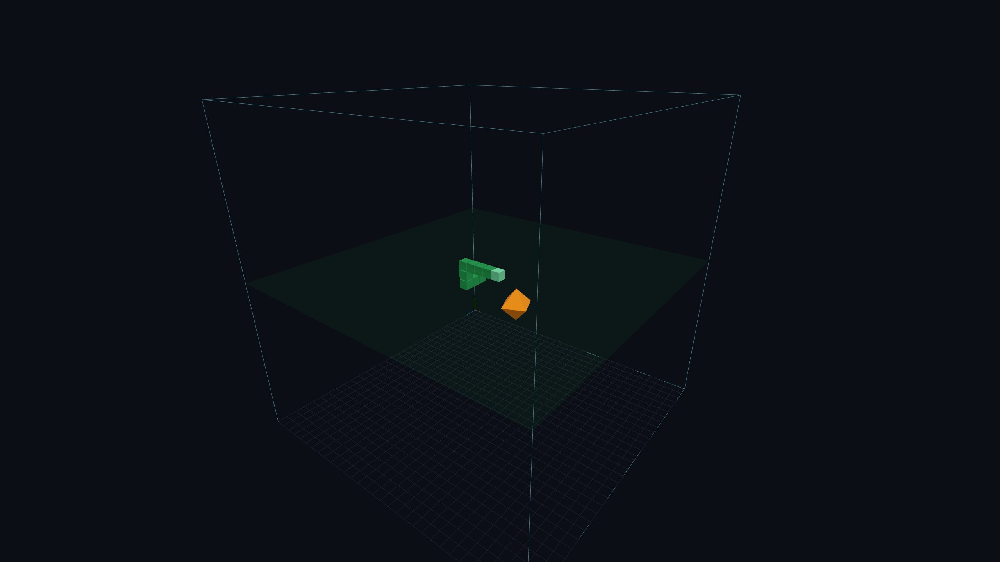
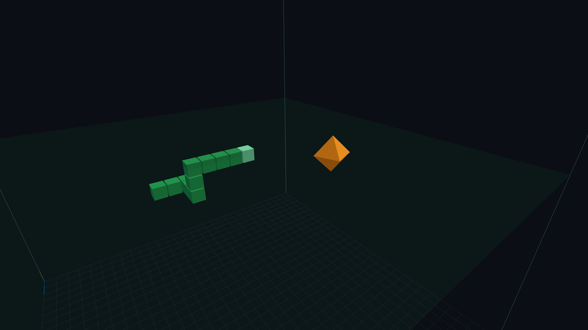

# Colubrid 🐍



A snake game with a twist: it's a full 3D volume, not a flat grid. You steer
through a cube of space, chasing food and dodging your own tail, with a free
orbiting camera so you can look at the arena from any angle.

<p>
  
  
</p>

This is a personal project — me messing around with Three.js and building
little 3D block games for fun. Not trying to run it as a serious open source
thing, but if a friend wants to poke at the code or throw in an idea, go for
it (see below).

Built with React, Three.js, and TypeScript.

## Play

**[colubrid.tohirr.xyz](https://colubrid.tohirr.xyz)**

Or run it locally — see Setup below.

It's also an installable web app: on your phone, open the link and pick
**Add to Home Screen** (Android offers it in the browser menu; on iOS it's
in Safari's share sheet). You get a proper app icon, the game opens
full-screen without browser chrome, and after the first visit it's cached
by a service worker — launches are instant and work fully offline (the
leaderboard naturally needs a connection).

Sound note for iPhones: the ring/silent switch mutes web audio, so if the
game seems silent on iOS, check the switch before blaming the ♪ button.

### Controls

| Action | Keyboard | Touch |
| --- | --- | --- |
| Steer | `W A S D` or arrow keys | Swipe with one finger |
| Move up / down | `Space` / `Shift` | — |
| Pause | `P` or `Esc` | Tap the pause button |
| Restart after game over | `R` | Tap the game-over screen |
| Orbit / zoom camera | Drag / scroll with mouse | Drag with two fingers |
| Mute / unmute sound | Tap the ♪ button | Tap the ♪ button |

The first visit shows a quick how-to-play card, and the game-over screen has
a share button for challenging friends.

### Leaderboard

There's a global top 10, shown on the game-over screen only when you make
it onto it. No accounts: every browser gets a random id in localStorage,
and the server derives an anonymous gamer name + emoji from it (you see
yourself as "You"; everyone else sees your generated name).

The backend is one serverless function ([`api/score.ts`](api/score.ts))
backed by Upstash Redis. To enable it on a Vercel deployment: add the
**Upstash Redis** integration from the Vercel Marketplace (free tier),
connect it to the project, and redeploy — the function picks up the
injected env vars (`UPSTASH_REDIS_REST_URL` / `UPSTASH_REDIS_REST_TOKEN`
or the `KV_REST_API_*` pair) automatically. Without them the endpoint
returns 503 and the game simply skips the leaderboard, so local dev
(`pnpm dev`) is unaffected.

Light analytics come for free from the same data: `player:{id}` hashes
hold per-player play counts and first/last-seen timestamps, and
`plays:{date}` counters track games per day — browse them in the Upstash
data browser.

Score by eating food; the snake speeds up as your score climbs. By default,
crossing an edge of the arena wraps you to the opposite side (only running
into yourself ends the game) — see `WALL_MODE` in
[`src/game/config.ts`](src/game/config.ts) if you'd rather play with solid
walls.

## Setup

Requires Node (see [`.nvmrc`](.nvmrc) for the version) and
[pnpm](https://pnpm.io).

```bash
pnpm install
pnpm dev      # start the dev server
```

Other useful scripts:

```bash
pnpm lint     # oxlint
pnpm build    # typecheck + production build
pnpm preview  # preview the production build locally
```

## Poking around the code

- [`src/App.tsx`](src/App.tsx) — the page: HUD, score, pause/game-over
  overlays.
- [`src/game/`](src/game) — the game itself, framework-free:
  - `config.ts` — tunable constants (grid size, speed, wall behavior) —
    the easiest place to start if you just want to mess with the feel
  - `state.ts` — game state and rules
  - `scene.ts` — Three.js scene setup and render loop
  - `input.ts` / `touch.ts` — keyboard and touch input
  - `steering.ts` — turning the snake's heading
  - `gizmo.ts` — the on-screen orientation cube
  - `audio.ts` — sound effects, synthesized with the Web Audio API (no
    audio files)

Game logic works in integer grid cells; only the scene layer converts cells
to world-space positions. Worth keeping that split if you add something —
makes the logic easy to reason about independent of rendering.

## Got an idea or found a bug?

Open an issue or just message me — no formal process here. If you send a PR,
running `pnpm build` and actually trying it in the browser first is
appreciated, but this is a hobby project, not a production app.
